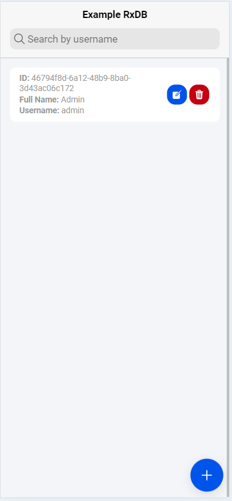
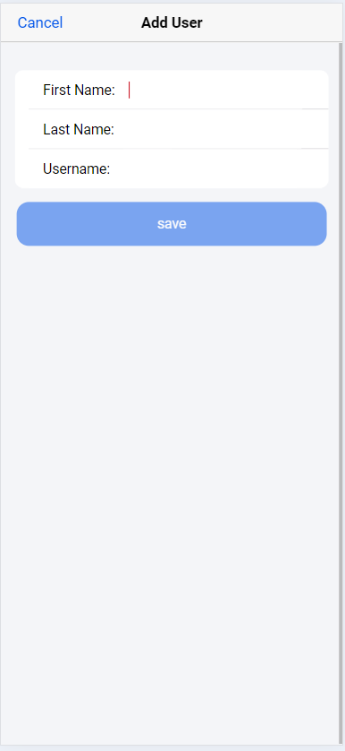

# ionic-rxdb

Este es un ejemplo basico de la integración de RxDB con Ionic Angular

- NodeJS: 20.11.1
- Angular: 18
- Ionic: 8
- RxDB: 15.30.2

## Ejecución

`git clone https://github.com/roonmorton/ionic-rxdb.git`\
`cd ionic-rxdb`\
`npm install`\
`ionic serve --port=8200`

Abrir navegador `http://localhost:8200`

## Capturas

